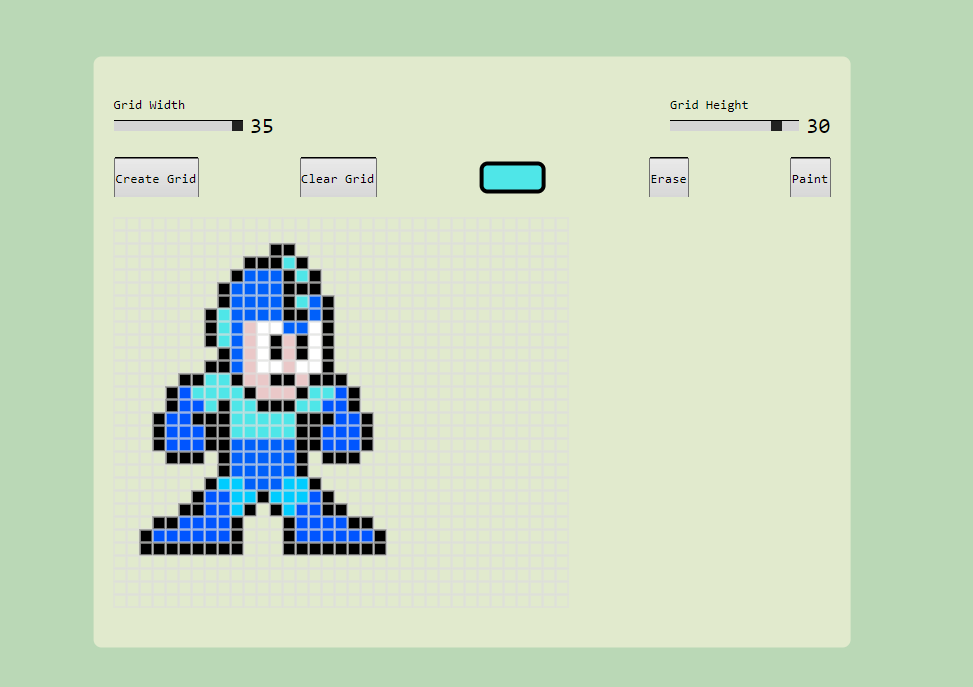

<h1>Gerador de Pixel Art</h1>

# Descrição

Esse Gerador de Pixel Art é uma aplicação web que permite o usuario criar arte em pixel de forma interativa. Desenvolvido com HTML, CSS e JavaScript, o projeto oferece uma interface para desenhar, colorir e personalizar suas criaçoes

# Funcionalidades

<ul>
    <li>Criação de Grade Personalizada: Defina o tamanho da grade para atender às necessidades específicas do seu projeto.</li>
     <li>Seleção de Cores: Escolha entre uma variedade de cores para dar vida às suas criações.</li>
      <li>Ferramentas de Desenho: Utilize ferramentas como pincel e borracha para facilitar o processo de desenho.</li>
</ul>

# Tecnologias Utilizadas

<ul>
    <li>HTML</li>
    <li>CSS</li>
    <li>JavaScript</li>
</ul>

# Screenshot

Aqui esta uma screenshtot do projeto :



# Instruções

- Execute no Terminal:

```sh
$ git clone https://github.com/WalyssonCavalcante/PixelArt-Generator.git

```

- Acesse o Diretório do Projeto:

```sh
cd PixelArt-Generator

```

- Abra o Arquivo index.html

# Contribuição

Contribuições são bem-vindas! Sinta-se à vontade para abrir issues para relatar bugs ou sugerir melhorias. Para contribuições de código, faça um fork do repositório, crie uma branch para sua feature ou correção, e envie um pull request.
